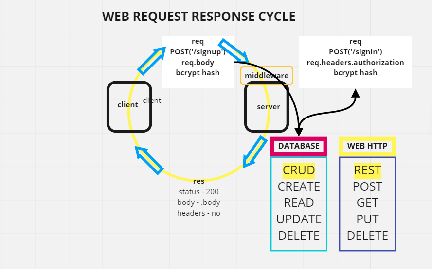

# basic-auth

building express server with user authentication, hash encryption and db storage using mongoDb

## Author: Fizzo Pannosch

**Version**: 1.0.0

<!-- (increment the patch/fix version number if you make more commits past your first submission) -->

### 
 links and resources 

<!-- #### 
 [heroku deployed site](https://fizzo-api-server.herokuapp.com/) 
 -->

<!--  -->

<!-- #### 
 [github actions](https://github.com/fizzo999/server-deployment-practice/actions) 
 -->

#### 
 [github pull request](https://github.com/fizzo999/basic-auth/pull/2) 

#### 
 [ci/cd - github](https://github.com/fizzo999/basic-auth/actions/) 

<!--  -->

## 
 UML DIAGRAM 

## Overview

building an express server with node.js. Writing our own tests with supertest and jest. Two POST routes (/signup and /signin). Modularize the code.

## Setup

git clone repo from github link:
https://github.com/fizzo999/basic-auth.git

.env requirements
PORT - Port Number
MONGODB_URI='mongodb://localhost:27017/users'

npm install
(to install dependencies: express, dotenv, supertest, jest, mongoose, base-64, bcrypt, cors)

Running the app
npm start
Endpoint: /signup to create a new user profile (username and password)
Endpoint: /signin to check credentials against stored hashed values

Tests
Unit Tests: npm run test

## Architecture

node.js based server that uses express library and dotenv package
tests performed with jest and supertest

## Change Log

04-26-2021 9:59pm - Application now has a fully-functional express server, with POST route ('/signup') and ('/signin') endpoints, mongodb working locally on my own machine.

## Credits and Collaborations

Number and name of feature: setup file structure, write server.js, index,js, 404.js, 500.js, yml - repo on github, auth routes, model/schema, verify with swagger
Estimate of time needed to complete: 3 hours
Start time: 4:00 pm
Finish time: 7:00 pm
Actual time needed to complete: 3 hours

Number and name of feature: data model, test suites, readme.md, wrrc diagram
Estimate of time needed to complete: 2 hours
Start time: 9:30 pm
Finish time: 11:00 pm
Actual time needed to complete: 1.5 hours
